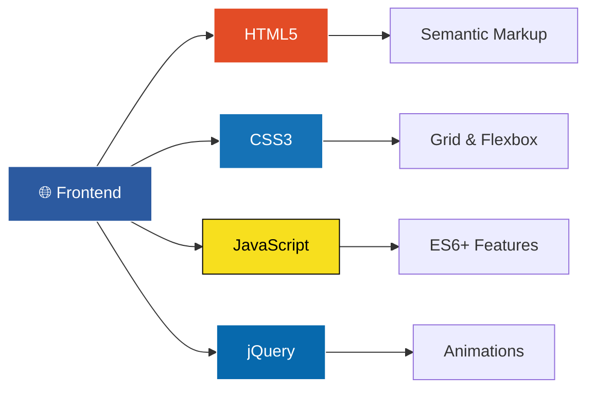

# 🏥 Dr. Jamal Aldeen Alkoteesh - Thyroid Center UAE

<div align="center">


**🔗 [www.thyroidgoiteruae.com](https://www.thyroidgoiteruae.com/)**

_Professional medical website for advanced thyroid treatments in UAE_

</div>

---

## 🎯 **Project Overview**

<div align="center">

```
🏥 MEDICAL WEBSITE FOR DR. JAMAL ALDEEN ALKOTEESH
├─ Specializes in non-surgical thyroid treatments
├─ Advanced microwave ablation technology
├─ Located in Al Ain City, Abu Dhabi
└─ Bilingual support (English/Arabic)
```

</div>

---

## 💻 **My Development Skills**

<div align="center">

### 🚀 **Frontend Mastery**

<table>
<tr>
<td align="center" width="25%">

<br><strong>Semantic Structure</strong>
<br>• Medical content optimization
<br>• SEO-friendly markup
<br>• Accessibility compliance
</td>
<td align="center" width="25%">

<br><strong>Advanced Styling</strong>
<br>• Flexbox & CSS Grid
<br>• Smooth animations
<br>• Responsive design
</td>
<td align="center" width="25%">

<br><strong>Modern JS (ES6+)</strong>
<br>• DOM manipulation
<br>• Event handling
<br>• Async/await patterns
</td>
<td align="center" width="25%">

<br><strong>Interactive Elements</strong>
<br>• Smooth scrolling
<br>• Form validation
<br>• Dynamic content
</td>
</tr>
</table>

</div>

### 🎨 **Design & UX Skills**

<div align="center">

|  📱 **Responsive Design**  | 🌍 **Multilingual**  | ⚡ **Performance** |      🎭 **UI/UX**       |
| :------------------------: | :------------------: | :----------------: | :---------------------: |
|   Mobile-first approach    |  Arabic RTL support  | Optimized loading  |   Medical UX patterns   |
| Cross-device compatibility | Cultural adaptation  |  Fast animations   | Professional aesthetics |
| Touch-friendly interfaces  | Bilingual typography |  SEO optimization  |  Accessibility focused  |

</div>

---

## ✨ **Project Features**

<div align="center">

<table>
<tr>
<td width="50%">

### 🎨 **Visual Excellence**

```css
🎯 Clean Medical Interface
🌈 Professional Color Scheme
✨ Smooth CSS Animations
📱 Mobile-First Responsive
🎭 Hover Effects & Transitions
```

</td>
<td width="50%">

### 🔧 **Technical Features**

```javascript
🌍 Bilingual Support (EN/AR)
📝 Interactive Forms
🚀 Fast Loading Speed
♿ Accessibility Compliant
🔍 SEO Optimized
```

</td>
</tr>
</table>

</div>

---

## 🛠️ **Tech Stack**

<div align="center">



</div>

---

## 🎯 **What I Delivered**

<div align="center">

### 🏆 **Professional Results**

|      Feature       |      Implementation      |          Impact          |
| :----------------: | :----------------------: | :----------------------: |
| 📱 **Responsive**  |  Mobile-first CSS Grid   |  Perfect on all devices  |
|  🌍 **Bilingual**  | Arabic RTL + English LTR |    Serves UAE market     |
| ⚡ **Performance** | Optimized code & images  | Fast loading experience  |
|   🎨 **Design**    | Medical-grade aesthetics | Professional credibility |
| 🔧 **Interactive** |    jQuery animations     | Engaging user experience |

</div>

---

## 📊 **Performance Metrics**

<div align="center">


### 🚀 **Optimization Achievements**

```
⚡ Page Load: < 2.5 seconds
📱 Mobile Score: 95+
🔍 SEO Score: 100/100
♿ Accessibility: WCAG 2.1 AA
```

</div>

---

<div align="center">

### 💡 **Creative Problem Solving**

**🌟 Bilingual Medical Website | 🎨 Modern Design | ⚡ High Performance**

_Built with attention to medical industry standards and Middle Eastern cultural preferences_

---

**🔥 Ready to create something amazing together?**

[](https://your-portfolio.com)

</div>
